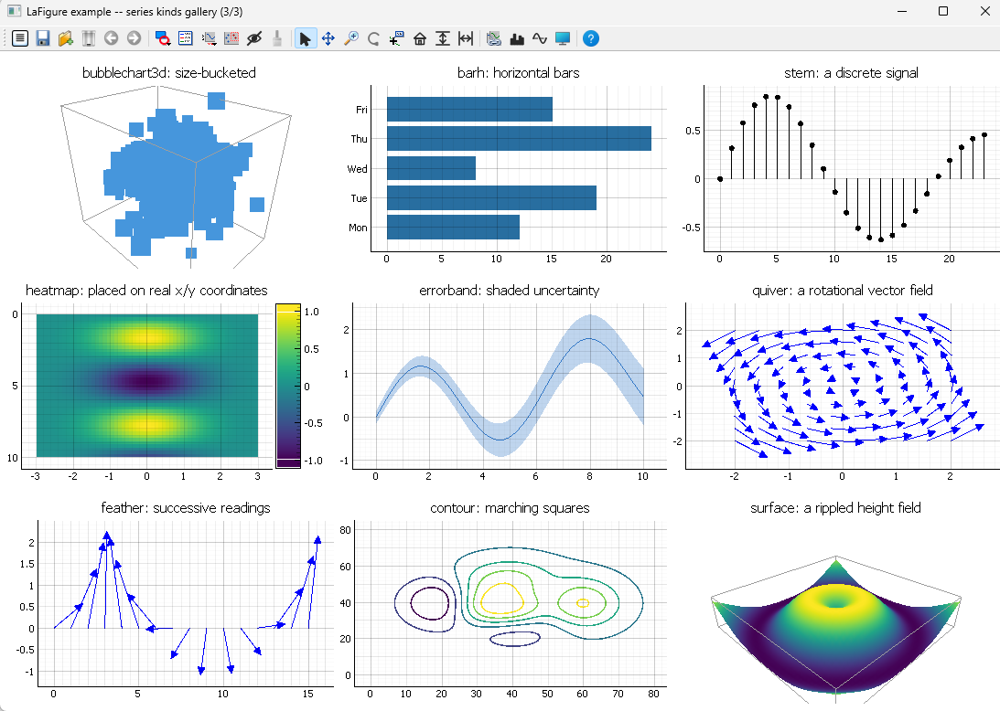

# LaFigure

A MATLAB-Figure-like interactive plotting window, built on [PyQtGraph](https://www.pyqtgraph.org/)
(Qt + OpenGL) so it stays fluent with millions of points.

Multiple subplots in a free-form grid, click to select, drag to resize/move/swap,
curve and subplot copy-paste (including across separate figure windows), undo/redo,
annotations, data brushing/linked selection, 3D scenes, interactive controls, and a
Figure Manager for tracking multiple open figures — see the full feature list and
design notes in [CLAUDE.md](CLAUDE.md).

It is aimed at data analysis, with a lot of freedom in the interactive plotting to
make it easier to find unknown patterns, investigate time series, then share reports
with the rest of the team.



## Install

Requires Python >= 3.9.

```bash
git clone https://github.com/AurelienRoy/LaFigure.git
cd LaFigure
pip install -e .
```

Optional extras: `pip install -e ".[pandas]"` (DataSource from a DataFrame),
`pip install -e ".[html]"` (HTML export via plotly).

Tested on Windows and Ubuntu 22.04/24.04 — see `.github/workflows/tests.yml`.

## Quickstart

```bash
python -m lafigure
```

opens a Figure Manager plus a demo figure. As a library:

```python
from pyqtgraph.Qt import QtWidgets
from lafigure import LaFigure

app = QtWidgets.QApplication([])
fig = LaFigure(empty=True)
ax = fig.subplot(0, 0, title="My data")
ax.plot([0, 1, 2, 3], [0, 1, 4, 9])
fig.show()
app.exec()
```

## Examples

More runnable examples are in [`examples/`](examples/). Each one is self-contained
(it adds the repo root to `sys.path` itself, since `lafigure` isn't pip-installed
as a prerequisite) — run any of them directly from anywhere with `python
examples/<name>.py`:

- **`series_kinds_gallery.py`** — a visual gallery of every plot kind the library
  ships (line, bar, scatter, polar, quiver, surface, ...), spread across three
  figure windows.
- **`line_signal_annotations.py`** — a single line plot with a legend and three
  annotations (text+arrow, data cursor, rectangle) placed from code.
- **`linked_brushing_scatter.py`** — two scatter plots and a histogram sharing one
  `DataSource`; drag a brush rectangle over either scatter to see the same rows
  highlight across all three.
- **`three_d_scene.py`** — a point cloud, a trajectory, and a height field in three
  3D subplots, showing that move/resize/select/undo all work the same as on a 2D
  subplot.
- **`interactive_controls.py`** — a scatter plot cross-filtered live by a slider
  and a checkbox in a separate control-panel window, with a reactive row-count
  table.
- **`groups_and_style.py`** — grouping related curves and recoloring a whole group
  at once with the built-in "raw/filtered" and "sensor family" color presets.
- **`copy_paste_across_figures.py`** — opens two separate figure windows and
  copies a whole subplot, then a single curve, from one into the other through
  the shared clipboard.
- **`custom_datatip_example.py`** — customizing a data cursor's text via
  `ax.datatip`, as both a format string and a Python callable, including on a 3D
  curve.
- **`image_processing_with_controls_example.py`** — a procedural grayscale image
  edited live by sliders/a colormap dropdown/an invert checkbox, every edit
  undoable (Ctrl+Z) back to the original.
- **`accelerometer_thermal_bias_example.py`** — a synthetic IMU dataset (a
  temperature-biased accelerometer driven by a heater's PWM schedule) across five
  linked subplots, demonstrating linked brushing on a realistic sensor scenario.

## Running the tests

```bash
QT_QPA_PLATFORM=offscreen python run_tests.py
```

No pytest — `run_tests.py` is a small standalone runner; pass name filters to
narrow it, e.g. `python run_tests.py layout`.

## Contributing

See [CLAUDE.md](CLAUDE.md) for the architecture, the module layout, and the
hard-won lessons behind this codebase's design. If you're coding here with
Claude Code, read it first — it's written for that.

Future directions:
Give maximal freedom to the user to manipulate figures/plots/data through mouse
clicks or keyboard shortcuts.
Once satisfied, give the ability to generate the equivalent code, to reproduce
the same figures immediately.
Exports are aimed to share with a team, with graphs providing zooming and data
cursor inspection capabilities, and .png images for document reports.
Many real world signals are noisy, only interesting on some time phases unknown
or described in enclosed metadata (modes, messages, ...), give capacities for
easy filtering and plotting these metadata.

## License

BSD 2-Clause — see [LICENSE](LICENSE).
